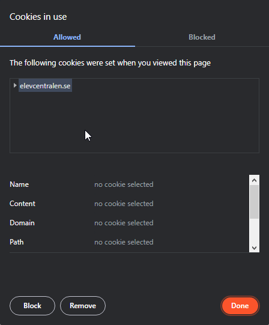

# How do I get my .SCFORMSAUTH?

The SCFORMSAUTH is a cookie for elevcentralen. On mobile devices it is alot harder to see your cookies than it is on a computer. If you do not know how to view your cookies, please google how to view your cookies, something along the lines of (remove '<' '>')
```
How do I view my cookies in <WEB_BROWSER> on <OPERATING_SYSTEM>?
```

After you have figured this out we can continue.

- Login to elevcentralen
- View your cookies in your browser, in my case, Chromium (e.g Edge, Google Chrome, Opera, Brave) I have to press the padlock icon next to url and then click the "Cookies" button.

Now this is going to be different depending on you browser, I will post a guide over how I do it, but can you either search on google or use this guide:
https://docs.microsoft.com/en-us/microsoft-edge/devtools-guide-chromium/storage/cookies

### How I do it
- I click the padlock icon next to url and then click the "Cookies" button. 
- I click the "Cookies" button. 

  

- I open the "elevcentralen.se" **NOTE: Some people may have the SCFORMSAUTH cookie in a "www.elevcentralen.se" folder!** 
- I click the "Cookies" folder. 

  

- I click the "SCFORMSAUTH" cookie.
  

- I copy the "SCFORMSAUTH" cookie and paste it into the ".SCFORMSAUTH" section on [ftf.phma.dev](https://ftf.phma.dev). ***NOTE: I am able to copy the cookie by dubble clicking or pressing `Ctrl + A` then `Ctrl + C`. Browsers may have cookies in a different way, please use google to find out or use the aformentioned guide by Microsoft.***
  

## Now you have the SCFORMSAUTH cookie, you can now use the Free Time Finder!