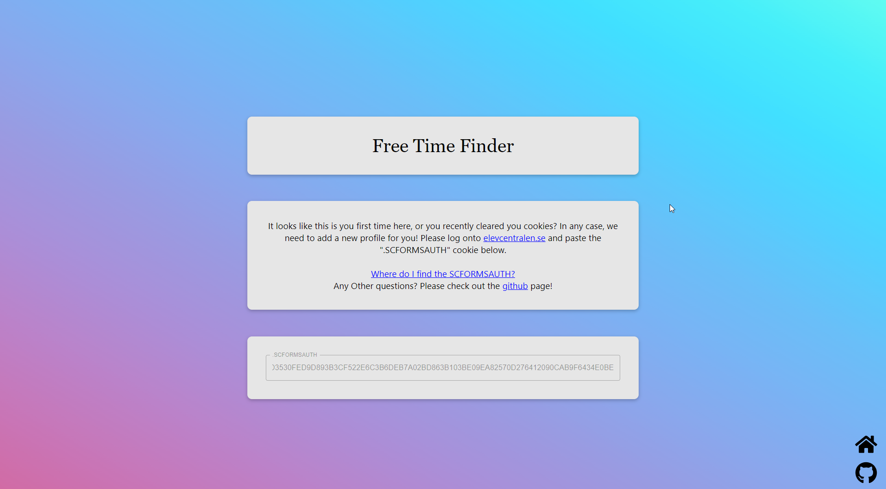
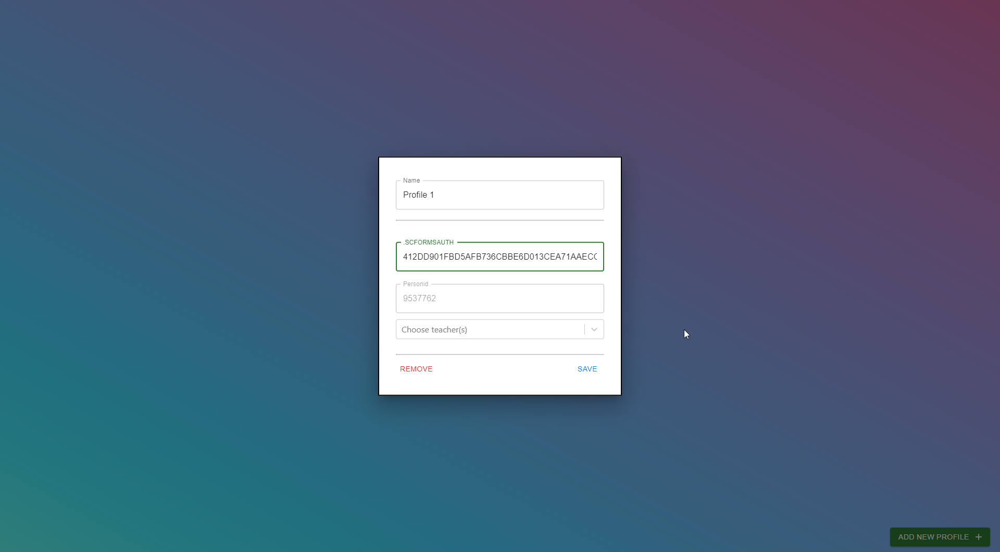
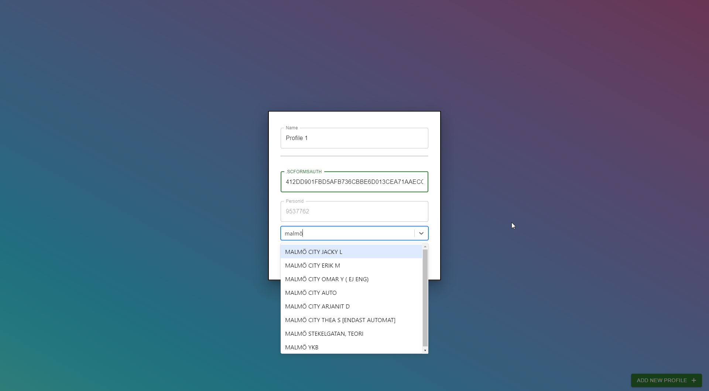
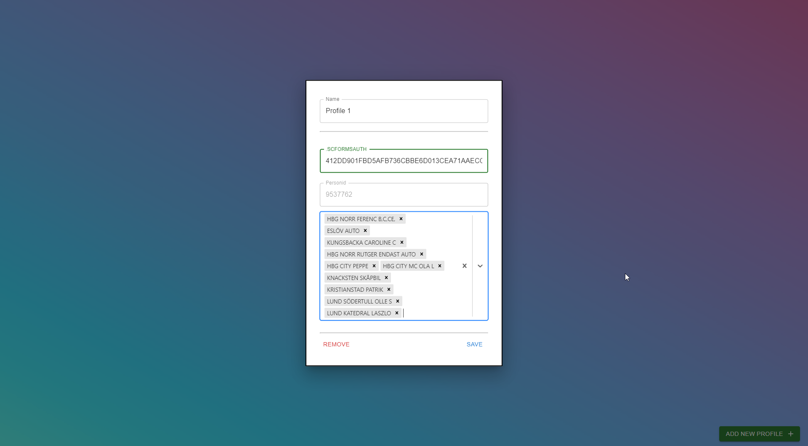
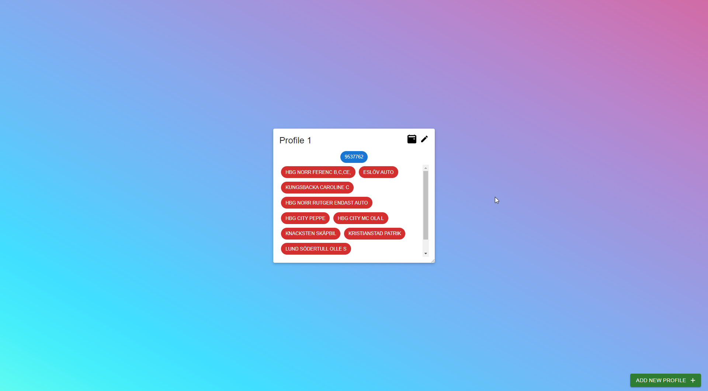
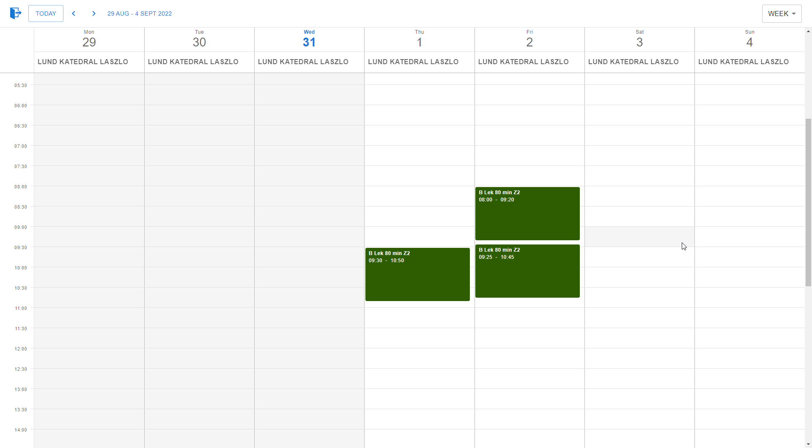
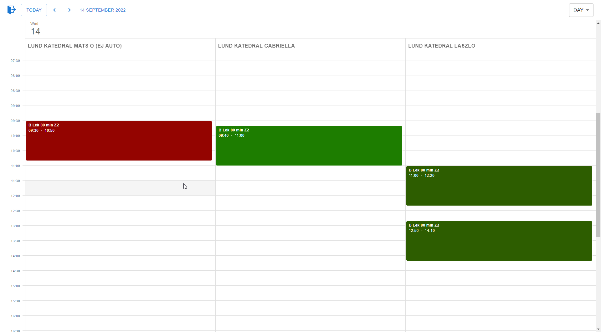
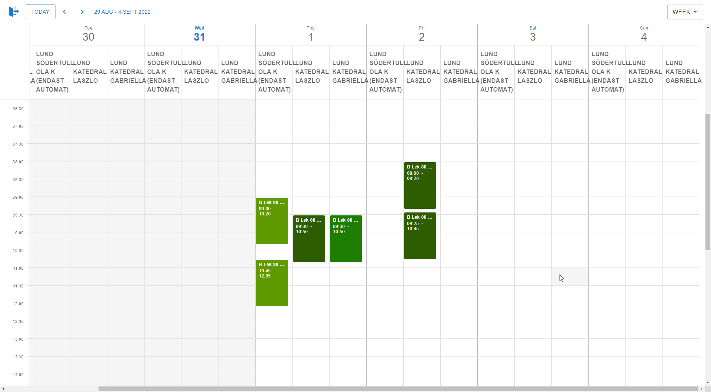
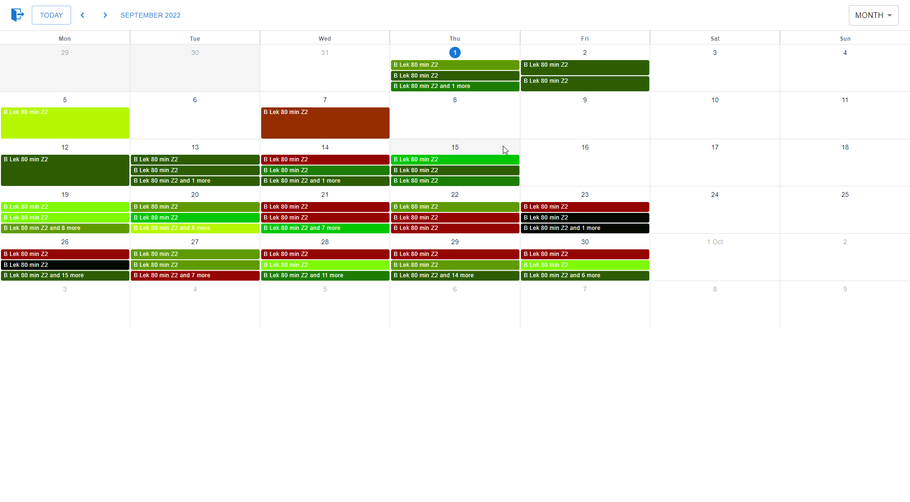
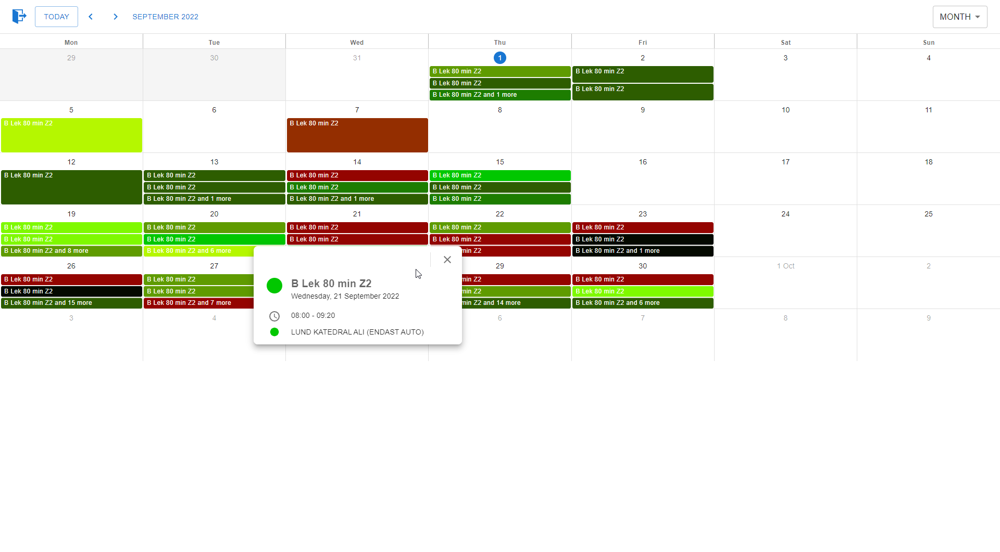

# Free Time Finder
A project I made because using elevcentralen to find a free driving lesson was a pain. In my case for elevcentalen I need to scroll through a list of teachers (every single employee at the company in Sweden) and then select one to book a lesson, their view only supports a week at a time and no calendar option. So I decided to do something better!

If you have any questions or comments feel free to open a issue here on GitHub.

# [Project site](https://ftf.phma.dev)

Useful links:
- [Frequently asked questions](./guides/FAQ.md)
- [How to build & run Free Time Finder](./guides/how%20to%20run%20or%20build%20Free%20Time%20Finder.md)
- [How do I get my .SCFORMSAUTH?](./guides/how%20to%20get%20SCFORMSAUTH.md)

# Features
- Automatically feching data from elevcentralen
- Search & pick the teachers you want to find a time for
- Multiple profiles where you can select different teachers
- Calendar with day, week and month views
- Teachers have different colors

# Pictures

